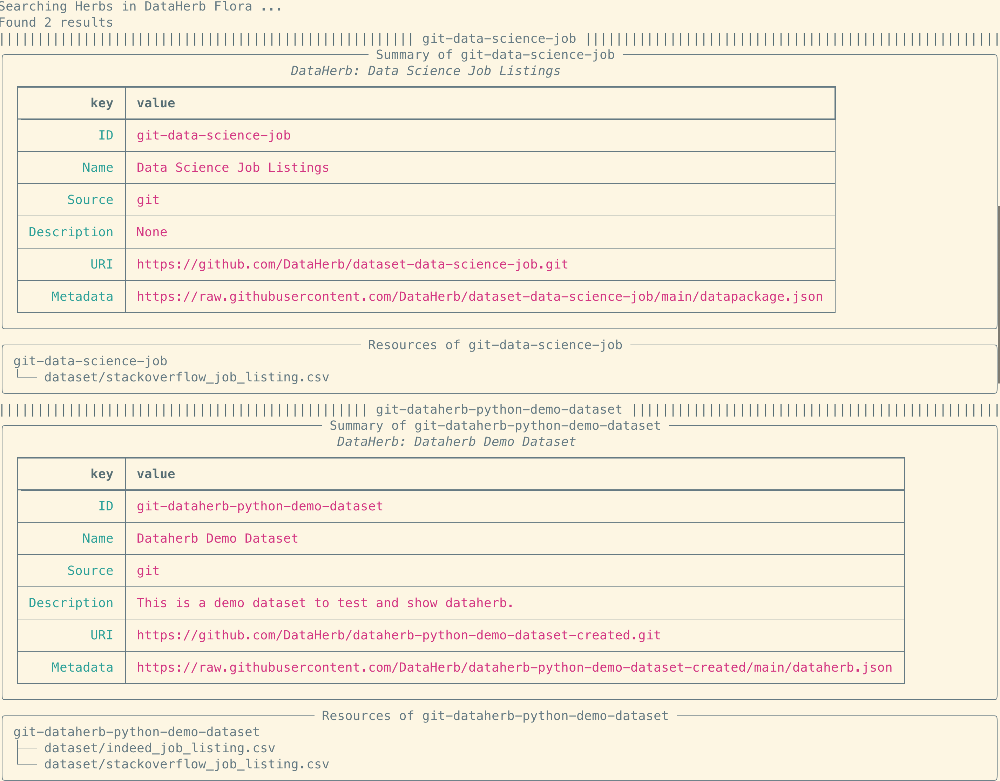

## Search


### Search by keyword

```bash
dataherb search git
```

From the returns, we can find the dataset id which can be used to download the dataset.

For example, we find this `git-dataherb-python-demo-dataset` id as we just added this dataset in the creation step.




### Search by ID

Search by dataherb id

```bash
dataherb search -i covid19_eu_data
```

### See Full Metadata of the Dataset

By default, the search result only shows the summary and lists the resources in the dataset. If the full metadata is needed, use the option `--full`.

```bash
dataherb search git --full
```

or

```bash
dataherb search -i covid19_eu_data --full
```
