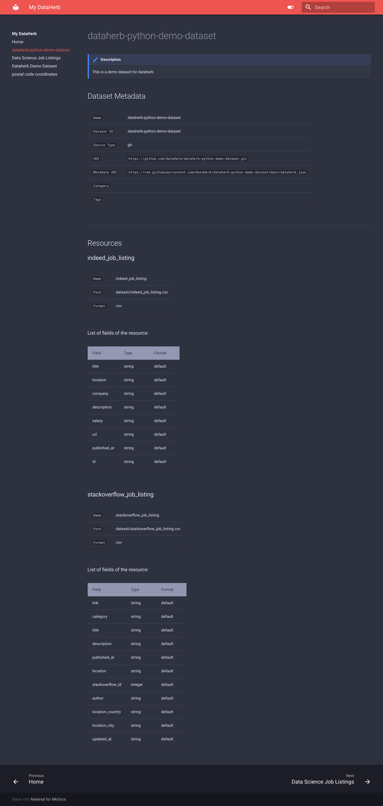

## Serve

!!! warning "WIP"

    Though it works, we are still improving the UI.


We can serve the whole flora as a website. To achieve this, simple run

```bash
dataherb serve
```

This is an example. You can search for datasets using the search box.




## How Does It Work

We are using the [material theme](https://github.com/squidfunk/mkdocs-material) of [mkdocs](https://www.mkdocs.org/) in the back to serve the full list of datasets.

By default, dataherb will add a folder `.serve` inside the working directory of dataherb.

!!! note "working directory"

    The working directory is set when using `dataherb configure`. There the command line will ask for the workdir](../configuration/index.md).

    To view the current setting of workdir, use the command

    ```bash
    dataherb configure -s
    ```
